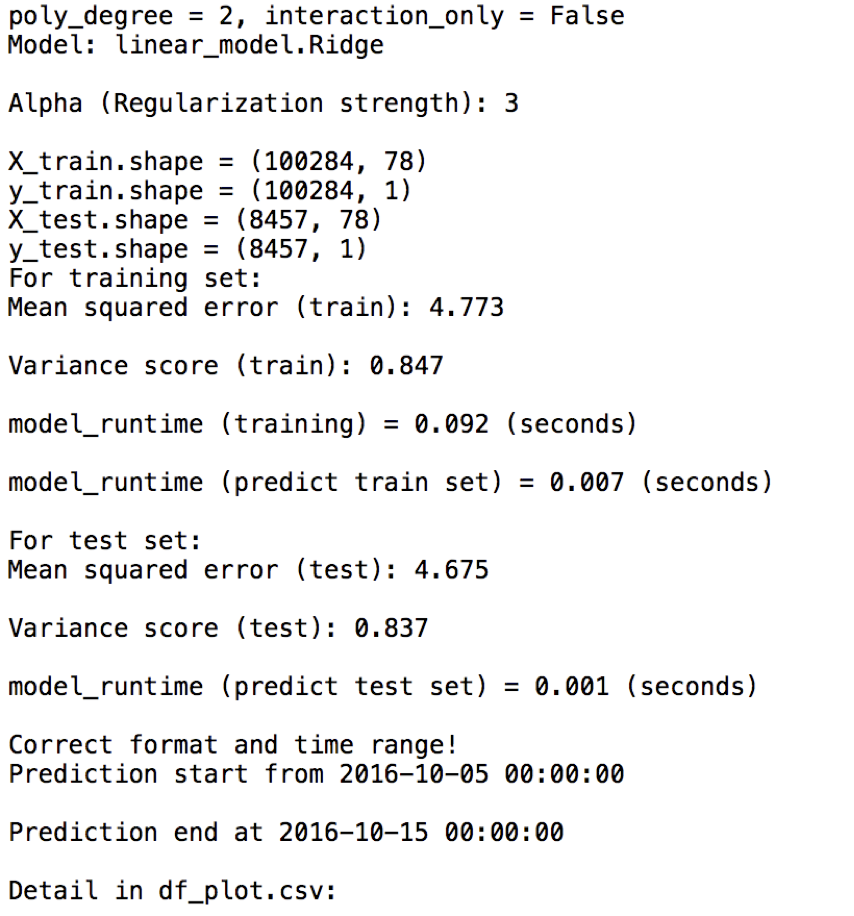
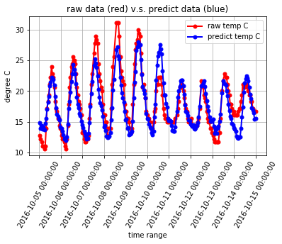
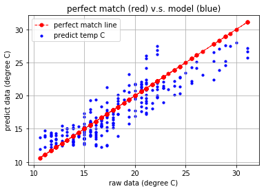

# temperature-prediction  

[implemented by Scikit-learn]  

**Summary**  
Generated new images from MINST & CelebA dataset using batch normalization technique, D/G Loss = 0.5 - 1.8  
  
**Goal:**    
Using public local weather station data (San Jose) from NOAA (National Oceanic and  
Atmospheric Administration) to predict temperature for the next 24 hours by using  
different Machine Learning Algorithms  

**Raw Data:**   
NOAA weather data of San Jose weather station (2007.01.01 - 2016.12.31)

**ML Algorithms (Scikit-learn):**  
linear_model.LinearRegression  
linear_model.Lasso  
linear_model.Ridge  
neural_network.MLPRegressor  

**Plotting:**  
matplotlib  

**Envs:**  
Anaconda and Python 2.7  

**Packages:**  
conda create -n weather_prediction_py27 python=2.7  
conda install numpy pandas matplotlib scikit-learn  
conda install spyder  

**Run Steps:**  
% git clone https://github.com/jasonx1011/weather_prediction.git  
% python weather_prediction.py  
or
using **spyder** to run weather_prediction.py (Recommended)  

**Sample Outputs:**  
   * Command Line Outputs:  

   * Plotting Outputs:  
  
  

<!---
too big & :height=... not work
{:height="36px" width="36px"}  
  
  
--->
